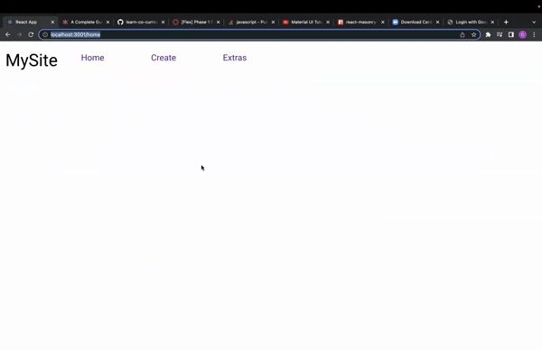
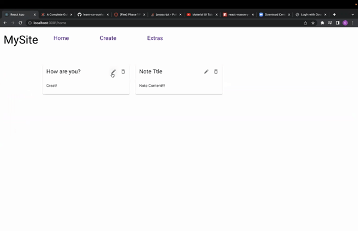
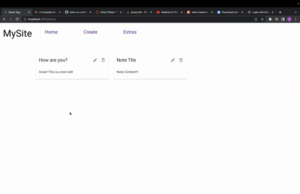
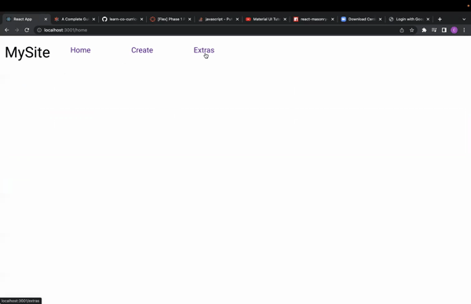

# REACT CARD APP project
**version 1.0.0**

---

Basic card creating app created using HTML, React, db.json. Allows user to create card, edit card, as well as delete cards. An extra tab is purposed to hold extra React built projects, currently holding: 
1. Calculator feature

---
## Created with
HTML / CSS / React / json-server / visual studio code

---
YouTube:

---

Create Card:

Edit Card:

Delete Card:

Extras:
